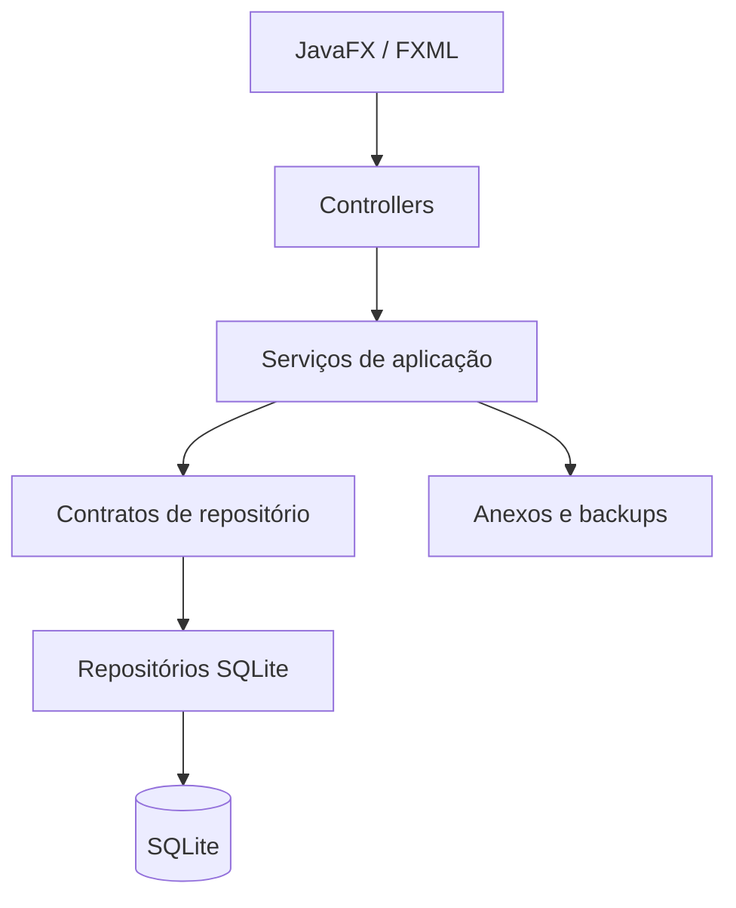

<p align="center">
  
</p>

<p align="center">
  Gestão financeira pessoal e familiar, local e organizada.
</p>

<p align="center">
  Java 21 · JavaFX 21.0.8 · SQLite · Windows x64 · MIT
</p>

# Hestia

O Hestia é um aplicativo desktop para organizar receitas, despesas e compromissos financeiros de uma
pessoa, casal ou família. Ele reúne movimentações, contas a pagar, recorrências, parcelamentos, perfis,
categorias, relatórios, anexos e backups em uma base local, sem depender de serviços bancários ou de uma
conta online.

A versão atual é a `1.0.0`, candidata à primeira publicação pública. O instalador Windows inclui seu
próprio runtime Java; quem apenas utiliza o aplicativo não precisa instalar Java, Maven ou uma IDE.

> O Hestia ajuda a organizar informações financeiras, mas não substitui backups regulares nem orientação
> financeira profissional.

## Índice

- [Sobre o Hestia](#sobre-o-hestia)
- [Funcionalidades](#funcionalidades)
- [Backup e restauração](#backup-e-restauração)
- [Onde meus dados ficam?](#onde-meus-dados-ficam)
- [Privacidade e internet](#privacidade-e-internet)
- [Requisitos](#requisitos)
- [Instalação](#instalação)
- [Atualização e desinstalação](#atualização-e-desinstalação)
- [Executando em desenvolvimento](#executando-em-desenvolvimento)
- [Testes e build](#testes-e-build)
- [Arquitetura](#arquitetura)
- [Banco de dados](#banco-de-dados)
- [Tecnologias](#tecnologias)
- [Segurança e integridade dos dados](#segurança-e-integridade-dos-dados)
- [Limitações atuais](#limitações-atuais)
- [Perguntas frequentes](#perguntas-frequentes)
- [Licença](#licença)

## Sobre o Hestia

O sistema foi pensado como uma central doméstica de organização financeira. Sua unidade principal é a
movimentação: algo que entrou, saiu, deve entrar ou deve ser pago. Um grupo financeiro local representa a
pessoa, o casal ou a família; dentro dele, perfis identificam responsáveis individuais ou compartilhados.

O Hestia segue quatro princípios observáveis na implementação atual:

- **Dados sob controle do usuário:** banco, anexos, backups e logs ficam no computador.
- **Organização sem integração bancária:** os registros são informados e administrados pelo próprio usuário.
- **Histórico preservado:** movimentações são canceladas, não apagadas; perfis e categorias em uso são
  desativados quando a exclusão comprometeria o histórico.
- **Valores exatos:** dinheiro é calculado com `BigDecimal` e persistido em centavos inteiros.

Na primeira execução, o aplicativo cria o grupo **Minha família** e as categorias básicas. Nenhuma pessoa
fictícia ou movimentação financeira é inserida automaticamente.

## Funcionalidades

### Painel mensal

O Painel é a tela inicial e apresenta o mês selecionado com dados reais do SQLite:

- receitas recebidas e ainda previstas;
- despesas pagas, pendentes e vencidas;
- resultado realizado e resultado projetado;
- próximos vencimentos pendentes;
- categorias com maior volume de despesas.

Movimentações canceladas não entram nos totais. Recorrências e parcelamentos são contabilizados pelas
movimentações geradas, evitando dupla contagem.

### Movimentações

Receitas e despesas compartilham o mesmo modelo financeiro. Cada movimentação pode conter descrição,
valor, perfil, categoria, data de referência, vencimento, situação, data de conclusão e observações.

A interface permite:

- criar e editar movimentações;
- consultar detalhes e origem;
- marcar uma receita como recebida ou uma despesa como paga;
- reabrir ou cancelar um registro;
- pesquisar por descrição;
- filtrar por mês, tipo, situação, perfil, categoria e origem;
- consultar somente despesas vencidas;
- adicionar, abrir e remover anexos.

Os valores são sempre positivos; o tipo da movimentação define se representam entrada ou saída. O
cancelamento preserva o registro em vez de removê-lo fisicamente.

### Contas a pagar

**Contas a pagar** é uma visualização especializada das movimentações de despesa, e não uma entidade
duplicada. Ela concentra compromissos pendentes e vencidos e oferece os mesmos recursos de edição,
pagamento, cancelamento, filtros e anexos.

O cadastro de uma nova conta permite escolher entre despesa única, recorrente ou parcelada.

### Receitas

A área **Receitas** apresenta as movimentações de entrada. Uma receita pode permanecer prevista, ser
marcada como recebida, ser reaberta ou cancelada. O fluxo utiliza as mesmas regras de perfis, categorias,
datas, filtros e anexos das demais movimentações.

### Despesas recorrentes

Recorrências representam despesas mensais repetidas. Uma regra define descrição, valor previsto, perfil,
categoria, primeiro vencimento, término opcional e observações.

O Hestia:

- cria ocorrências mensais como movimentações reais;
- mantém um horizonte até 12 meses à frente e o amplia em novas inicializações;
- impede mais de uma ocorrência da mesma regra na mesma competência;
- ajusta os dias 29, 30 e 31 para o último dia de meses menores, sem perder o dia-base;
- permite editar ou desativar a regra;
- preserva ocorrências pagas e ocorrências personalizadas;
- pode cancelar ocorrências futuras pendentes e não personalizadas ao desativar uma regra.

A periodicidade disponível nesta versão é mensal e somente para despesas.

### Parcelamentos

Uma compra parcelada gera um plano e suas movimentações de despesa em uma única operação transacional.
São aceitas de 1 a 120 parcelas.

O valor total é convertido em centavos e distribuído exatamente. Quando a divisão deixa resto, os
centavos adicionais são atribuídos às primeiras parcelas — por exemplo, R$ 100,00 em três parcelas gera
R$ 33,34, R$ 33,33 e R$ 33,33. As datas seguem o mesmo ajuste mensal das recorrências.

Parcelas podem ser pagas e reabertas pelo fluxo comum. Também é possível cancelar apenas as parcelas
restantes, preservando as já pagas. Parcelamentos são compromissos independentes e não possuem vínculo com
cartões de crédito ou faturas.

### Perfis

Perfis identificam a quem uma movimentação pertence. Há dois tipos:

- **Pessoa:** representa um indivíduo;
- **Compartilhado:** representa despesas ou receitas do casal, da família ou do grupo.

Não há limite fixo de perfis. É possível criar, editar, desativar, reativar e, quando não houver
referências, excluir. Perfis utilizados por movimentações, compromissos ou anexos precisam ser desativados
para que o histórico continue íntegro.

### Categorias

Categorias classificam receitas e despesas. O Hestia fornece categorias padrão e permite criar categorias
personalizadas para o grupo atual.

É possível pesquisar, filtrar por tipo, editar nome e cor, mostrar inativas, desativar, reativar e excluir
categorias sem uso. Categorias padrão são personalizadas por grupo: nome, cor e visibilidade podem mudar
sem alterar a definição global. Uma categoria já utilizada é desativada em vez de apagada.

### Relatórios e PDF

O relatório mensal apresenta:

- totais de receitas e despesas;
- resultado projetado;
- valores recebidos, previstos, pagos, pendentes e vencidos;
- comparação com o mês anterior;
- distribuição de despesas por categoria e por perfil.

O período pode ser exportado como PDF estruturado com Apache PDFBox. O arquivo contém os dados do relatório
e a data de geração; ele não é uma captura de tela.

### Anexos

PDFs e imagens podem ser anexados diretamente a perfis e movimentações. Os formatos aceitos são PDF, PNG,
JPG e JPEG, com limite padrão de 20 MB por arquivo.

Antes de importar, o Hestia compara a extensão com a assinatura real, calcula SHA-256 e gera um nome físico
aleatório. O nome original permanece nos metadados e na interface. Os arquivos não são armazenados como
BLOB no SQLite; ficam na pasta local de anexos e acompanham o backup completo.

Não há uma área principal separada chamada “Documentos”. O acesso aos anexos ocorre no contexto do perfil
ou da movimentação relacionada.

## Backup e restauração

A tela **Configurações** oferece backup manual, restauração e backup automático opcional.

### Criar um backup

1. Abra **Configurações**.
2. Selecione **Criar backup**.
3. Escolha onde salvar o arquivo `.hestia-backup`.
4. Opcionalmente, ative a proteção por senha e confirme a senha.

O backup contém um snapshot consistente do banco, os anexos válidos e um manifesto com versões, tamanhos
e hashes. Logs, cache, temporários e backups anteriores não são incluídos. Quando uma senha é informada,
o arquivo usa AES-256; a senha não é salva pelo Hestia e não pode ser recuperada pelo aplicativo.

O backup automático precisa ser ativado explicitamente. Ele executa no máximo uma vez por dia, salva no
diretório escolhido e mantém a quantidade de cópias configurada, entre 1 e 100. Backups automáticos não
utilizam senha nesta versão.

### Restaurar um backup

1. Abra **Configurações** e selecione **Restaurar backup**.
2. Escolha um arquivo `.hestia-backup`.
3. Informe a senha, se o arquivo estiver protegido.
4. Confirme a substituição e reinicie o Hestia após a conclusão.

Antes de modificar os dados ativos, o aplicativo valida o ZIP, caminhos, manifesto, tamanhos, hashes,
integridade do SQLite e compatibilidade do schema. Também cria automaticamente uma cópia de segurança do
estado atual. Se a aplicação do backup falhar, banco e anexos anteriores são restaurados.

Restaurar substitui o banco e os anexos atuais pelo conteúdo do backup. Mantenha cópias importantes também
em outro dispositivo ou local de armazenamento confiável.

## Onde meus dados ficam?

No Windows, a raiz padrão é:

```text
%LOCALAPPDATA%\Hestia
```

Estrutura utilizada pela aplicação (alguns arquivos surgem somente após a funcionalidade correspondente):

```text
Hestia/
├── data/
│   ├── hestia.db
│   └── backup.properties
├── attachments/
├── backups/
├── cache/
├── temp/
└── logs/
```

- `data/hestia.db`: banco SQLite;
- `data/backup.properties`: preferências do backup automático, sem senhas;
- `attachments/`: PDFs e imagens vinculados aos registros;
- `backups/`: cópias de segurança internas criadas antes de restaurações;
- `cache/` e `temp/`: arquivos de trabalho;
- `logs/`: registros técnicos rotativos.

O diretório pode ser substituído pela propriedade de sistema `hestia.data.dir` ou pela variável de
ambiente `HESTIA_DATA_DIR`. A propriedade tem precedência. Testes automatizados utilizam diretórios
temporários e não acessam os dados reais do usuário.

## Privacidade e internet

### O Hestia precisa de internet?

Não para suas funções de uso diário. O aplicativo instalado não contém integração de rede para registrar,
consultar, anexar, gerar relatórios ou criar backups. Os dados permanecem nos arquivos locais descritos
acima.

O acesso à internet pode ser necessário no ambiente de desenvolvimento para o Maven baixar dependências e
para o script de release obter o JDK e o WiX oficiais na primeira execução.

### Integração bancária

O Hestia não se conecta a bancos, Open Finance ou serviços de cartão. Também não possui contas bancárias,
carteiras, controle de saldo, cartões de crédito, faturas, limites, transferências, importação automática
ou sincronização em nuvem. Essa é uma delimitação intencional do domínio: o aplicativo organiza
compromissos informados pelo usuário.

## Requisitos

### Usuário final

- Windows x64;
- espaço para a aplicação, o banco, os anexos e os backups;
- permissão de escrita no perfil local do Windows.

> O instalador do Hestia inclui o runtime Java necessário. Não é preciso instalar Java separadamente.

A distribuição nativa atual foi construída e testada no Windows. Outras plataformas não possuem pacote
oficial nesta versão.

### Desenvolvimento

- JDK 21 ou mais recente, compilando com `--release 21`;
- Maven 3.9 ou mais recente disponível no `PATH`;
- Git, para clonar e versionar o projeto;
- uma IDE Java é opcional.

## Instalação

### Windows

O artefato atual é o instalador x64:

```text
Hestia-1.0.0-Setup.exe
```

Quando ele for disponibilizado por um canal confiável:

1. obtenha o instalador e confira o hash SHA-256 publicado junto ao arquivo;
2. execute o EXE;
3. escolha o diretório, se desejar, e conclua a instalação;
4. abra o Hestia pelo Menu Iniciar ou pelo atalho da Área de Trabalho.

A instalação padrão é por usuário, em `%LOCALAPPDATA%\Hestia Application`, e não exige privilégios
administrativos. O Java 21 necessário acompanha o programa.

### Aviso sobre assinatura e SmartScreen

A candidata 1.0.0 gerada atualmente não possui assinatura Authenticode porque não há certificado Code
Signing configurado. Por isso, o Windows pode apresentar um aviso de reputação do SmartScreen.

Não ignore alertas indiscriminadamente: confirme a origem do instalador e compare seu SHA-256 com o valor
publicado pelo projeto. Consulte o [relatório da release](docs/release-report.md) para o estado exato do
artefato candidato.

## Atualização e desinstalação

### Atualização

Não existe atualização automática. Uma versão nova deve ser instalada sobre a anterior usando o novo
instalador. O programa e os dados ficam em diretórios separados; ao abrir a nova versão, migrations
pendentes do SQLite são aplicadas antes do uso.

Faça um backup manual antes de atualizar. O processo de upgrade do instalador está preparado, mas uma
atualização real entre duas versões nativas distintas ainda precisa ser homologada antes de ser prometida
como fluxo público definitivo.

### Desinstalação

Use **Configurações do Windows → Aplicativos instalados → Hestia → Desinstalar**. A desinstalação remove o
programa, o runtime privado e os atalhos, mas preserva `%LOCALAPPDATA%\Hestia`.

Preservar essa pasta permite reencontrar os dados após uma reinstalação. Para remover definitivamente
banco, anexos, backups e logs, faça primeiro as cópias desejadas e apague manualmente a pasta de dados.

## Executando em desenvolvimento

Clone o repositório e entre na pasta do projeto:

```shell
git clone https://github.com/ryanoviski/Hestia.git
cd Hestia
```

Execute com o plugin JavaFX:

```shell
mvn javafx:run
```

Para isolar os dados de desenvolvimento no PowerShell:

```powershell
$env:HESTIA_DATA_DIR = "$PWD\.hestia"
mvn javafx:run
```

O ponto de entrada é `HestiaLauncher`, separado de `HestiaApplication` para simplificar execução e
empacotamento.

## Testes e build

### Testes

A suíte usa JUnit 5 e AssertJ. Os testes trabalham com diretórios e bancos temporários e cobrem, entre
outras áreas:

- criação do banco, migrations, idempotência e chaves estrangeiras;
- perfis, categorias, movimentações e cálculos mensais;
- recorrências, parcelamentos e transações compostas;
- anexos, validação de arquivos, backup e restauração;
- relatórios e exportação PDF;
- recursos FXML/CSS e smoke tests JavaFX.

Execute:

```shell
mvn clean test
```

### Build Maven

Para compilar, testar e gerar o JAR comum e o JAR executável com dependências:

```shell
mvn clean package
```

O JAR executável é criado em:

```text
target/hestia-1.0.0-executable.jar
```

Ele pode ser iniciado em um ambiente com JDK 21 ou mais recente:

```shell
java --enable-native-access=ALL-UNNAMED -jar target/hestia-1.0.0-executable.jar
```

### Release Windows

No PowerShell:

```powershell
.\scripts\build-release.ps1 -PackageType exe
```

O script:

1. exige uma versão final `MAJOR.MINOR.PATCH`, sem `SNAPSHOT`;
2. executa o build Maven;
3. baixa e verifica Microsoft OpenJDK 21 e WiX 3.14.1;
4. usa `jlink` para criar um runtime reduzido;
5. usa `jpackage` para gerar o instalador por usuário;
6. cria o ícone multirresolução, copia licenças e calcula SHA-256.

Os artefatos locais ficam em `release/`, diretório ignorado pelo Git. Detalhes de empacotamento, assinatura
e homologação estão em [docs/windows-release.md](docs/windows-release.md).

## Arquitetura

O projeto usa uma arquitetura em camadas com composição explícita em `ApplicationBootstrap`:

- **presentation:** FXML, controllers JavaFX e componentes visuais;
- **application:** serviços, DTOs, validações e contratos de repositório;
- **domain:** modelos, enums e exceções sem dependência de JavaFX ou SQLite;
- **infrastructure:** conexões, migrations, repositórios SQLite e armazenamento de arquivos;
- **config:** metadados, diretórios e montagem das dependências;
- **util:** utilitários compartilhados, como conversão monetária.



O fluxo comum é `FXML/componente → controller → serviço → contrato de repositório → implementação SQLite`.
Controllers não executam SQL e as regras financeiras ficam fora da interface.

Consulte [docs/architecture.md](docs/architecture.md) para as decisões técnicas completas.

## Estrutura do projeto

```text
Hestia/
├── docs/                         # arquitetura, auditorias e release
├── scripts/                      # build e assinatura da distribuição Windows
├── src/
│   ├── main/
│   │   ├── java/io/github/ryanoviski/hestia/
│   │   │   ├── application/      # serviços, DTOs e contratos
│   │   │   ├── config/           # inicialização e caminhos
│   │   │   ├── domain/           # modelos, enums e exceções
│   │   │   ├── infrastructure/   # SQLite, migrations e arquivos
│   │   │   ├── presentation/     # controllers e componentes JavaFX
│   │   │   └── util/             # utilitários compartilhados
│   │   ├── resources/
│   │   │   ├── db/migrations/    # scripts SQL versionados
│   │   │   ├── fxml/             # telas
│   │   │   ├── images/branding/  # identidade visual
│   │   │   └── styles/           # CSS externo
│   │   └── version/              # versão filtrada pelo Maven
│   └── test/java/                # testes unitários, integração e UI smoke
├── pom.xml
├── LICENSE
└── THIRD-PARTY-NOTICES.md
```

## Banco de dados

O Hestia usa SQLite por meio do SQLite JDBC. Cada operação abre sua própria conexão e fecha os recursos
com `try-with-resources`; não existe uma conexão global mantida aberta. Todas as conexões ativam chaves
estrangeiras e configuram espera de cinco segundos para bloqueios.

### Migrations

Os scripts ficam em `src/main/resources/db/migrations` e são aplicados em ordem pelo `MigrationRunner`.
Versão, descrição e instante de aplicação são registrados em `schema_history`, impedindo repetição. Cada
migration é transacional; uma falha faz rollback e interrompe a inicialização.

Uma migration já distribuída não deve ser alterada. Mudanças futuras de schema devem receber uma nova
versão sequencial. A versão atual possui migrations de `V001` a `V005`.

### Valores monetários

O domínio utiliza `BigDecimal`. Antes da persistência, o valor é convertido de forma exata para centavos e
armazenado em uma coluna SQLite `INTEGER`. `double` e `float` não são usados para dinheiro.

### Datas

- `LocalDate`: referência, vencimento e conclusão, persistidos em ISO-8601;
- `YearMonth`: filtros e competências mensais;
- `Instant`: auditoria de criação e atualização, armazenada como texto ISO-8601 UTC.

## Tecnologias

| Tecnologia | Versão | Uso |
| --- | ---: | --- |
| Java | 21 LTS | linguagem e runtime-base |
| JavaFX / FXML | 21.0.8 | interface desktop |
| Maven | 3.9+ | compilação, testes e empacotamento |
| SQLite JDBC | 3.50.3.0 | persistência local |
| SLF4J | 2.0.17 | API de logging |
| Logback | 1.5.34 | logs rotativos |
| Apache PDFBox | 3.0.8 | relatórios PDF e leitura de PDFs anexados |
| Zip4j | 2.11.6 | backups ZIP e proteção AES-256 opcional |
| Jackson | 2.22.1 | manifesto JSON dos backups |
| JUnit | 5.13.4 | testes automatizados |
| AssertJ | 3.27.7 | asserções dos testes |

As licenças das bibliotecas são relacionadas em
[THIRD-PARTY-NOTICES.md](THIRD-PARTY-NOTICES.md).

## Segurança e integridade dos dados

O projeto aplica mecanismos técnicos para reduzir erros e corrupção, sem prometer segurança absoluta:

- consultas variáveis usam `PreparedStatement`;
- chaves estrangeiras e restrições protegem relações do SQLite;
- migrations e operações compostas usam transações;
- backups validam manifesto, tamanhos, SHA-256 e integridade do banco;
- restaurações rejeitam caminhos inseguros, arquivos excessivos e schemas futuros;
- anexos validam conteúdo, tamanho, extensão e confinamento de caminho;
- erros técnicos são registrados em log sem exibir stack traces ao usuário;
- nenhum segredo ou senha de backup é persistido.

O relatório de vulnerabilidades da candidata está em
[docs/release-security-report.md](docs/release-security-report.md). Bancos de vulnerabilidades mudam com o
tempo, portanto a varredura deve ser repetida antes de cada publicação.

## Limitações atuais

- distribuição nativa disponível somente para Windows x64;
- sem autenticação ou separação por usuários do sistema;
- sem nuvem, sincronização entre dispositivos ou compartilhamento online;
- sem integração bancária, Open Finance ou importação automática;
- recorrências mensais e somente de despesas;
- parcelamentos somente de despesas e sem vínculo com cartões;
- relatórios mensais, sem séries anuais ou exportação para planilhas;
- sem OCR e sem importação automática de documentos;
- instalador candidato ainda sem assinatura digital;
- homologação visual e do instalador em uma máquina Windows limpa ainda pendente.

O Hestia não pretende funcionar como banco, carteira digital, controlador de saldo bancário ou gerenciador
de cartões e faturas.

## Perguntas frequentes

### Preciso instalar Java?

Não ao usar o instalador Windows. Ele inclui um runtime Java privado. Java e Maven são necessários apenas
para desenvolvimento ou execução direta pelo código/JAR.

### O Hestia precisa de internet?

Não para o uso do aplicativo instalado. O ambiente de desenvolvimento precisa de internet na primeira
resolução de dependências e ferramentas de empacotamento.

### Onde ficam meus dados?

Por padrão, em `%LOCALAPPDATA%\Hestia`. A tela **Configurações** também exibe o caminho efetivamente usado
naquele computador.

### Posso fazer backup?

Sim. O backup manual inclui banco e anexos e pode ter senha. Há também backup automático diário opcional,
sem senha nesta versão.

### Posso restaurar os dados em outro computador?

Sim, levando o arquivo `.hestia-backup` para outro computador e usando **Configurações → Restaurar
backup** em uma versão compatível do Hestia. Guarde a senha se o arquivo estiver protegido.

### O Hestia conecta à minha conta bancária ou cartão?

Não. Todos os registros são administrados localmente e parcelamentos não possuem relação com cartões.

### O que acontece se eu desinstalar?

O programa e o runtime são removidos, mas o diretório `%LOCALAPPDATA%\Hestia` é preservado. Isso permite
reinstalar sem perder os dados locais. Faça backup antes de qualquer remoção manual dessa pasta.

## Estado do projeto

A versão `1.0.0` possui build, testes, inicialização, instalador, persistência, backup/restauração e
desinstalação verificados na máquina de desenvolvimento. Ela permanece como candidata enquanto não for
concluída a homologação manual em um Windows limpo.

Evidências e pendências estão documentadas em [docs/release-report.md](docs/release-report.md).

## Licença

O Hestia é distribuído sob a licença MIT. Consulte [LICENSE](LICENSE).

As licenças e avisos dos componentes de terceiros estão em
[THIRD-PARTY-NOTICES.md](THIRD-PARTY-NOTICES.md).
